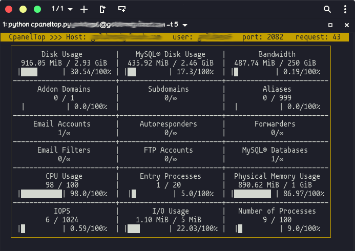

[](https://www.python.org/)   [](https://www.codacy.com/manual/gictorbit/cpaneltop?utm_source=github.com&amp;utm_medium=referral&amp;utm_content=GictorBit/cpaneltop&amp;utm_campaign=Badge_Grade)    [](http://perso.crans.org/besson/LICENSE.html)    

## Description
### CpanelTop is a Python command line script to monitor the usage of cpanel resources. cpaneltop can login to your host panel and fetch the statistics table and display resource usage in your terminal



<br></br>

# Installation

for using this program ,you can run `cpaneltop.py` that provided in `cpaneltop/app`directory manually<br> or install it using installer in linux machins</br>

first of all you need to clone the directory :


```bash
git clone "https://github.com/Gictorbit/cpaneltop.git" && cd cpaneltop
```

and then should install python package reqirements

```bash
pip install -r requirements.txt
```
>## install with installer script
>```bash
>chmod +x install.sh
>./install.sh
>```

>## run manually
>```bash
>cd app/
>python3 cpaneltop.py
>```

<br></br>

# Usage

You can also customize your requests with the parameters defined in the program . <br>
in this section , cpaneltop parameters explained:

---
<details open=open>
<summary>
username@host
</summary>

for connect to your cpanel host you should enter your username and domain or ip address as parameter <br> with following format:</br>

`username@domain`

```bash
    cpaneltop username@host
```
</details>

---
<details>
<summary>
port (-p , --time)
</summary>

By default the script uses  the specified cpanel port `2082`<br>
you can change it with `-p` or `--port` arguments</br>

```bash
cpaneltop username@host -p 1234
```
or
```bash
cpaneltop username@host --port 2082
```
</details>

---
<details>
<summary>
time (-t , --time)
</summary>

the another parameter you can use is `-t` or `--time`</br>
By default, this program refresh your cpanel host information every 10 seconds.</br>
If you do'nt want to do this, you can set the time argument to `1`
whith Doing this , will no longer update the information and only display detail for one request .

```bash
cpaneltop username@host --time 1
```
or you can customize update time  with numeric values between 5 untill 60 second.

```bash
cpaneltop username@host -t 25
```

</details>

---

<details>
<summary>
ssl (-s , --ssl)
</summary>

most users have `http` connection on cpanel login page ,so cpaneltop uses to `http` by default.<br>
if you have `https` connection you should use `-s` or `--ssl` parameter and pass `yes` or `no` arguments to that.</br>

```bash
cpaneltop username@host --ssl yes
```
</details>

---

<details open=open>
<summary>
PassWord
</summary>
after using above parameters you can hit enter key and enter your password in secure mode
</details>

---

>### Note:
>for exit from program you shoud press `q` button 

<br></br>

# Example

```bash
cpaneltop admin@example.com 
```

```bash
cpaneltop admin@example.com -t 5
```

```bash
cpaneltop admin@example.com -p 12345 --time 12
```

```bash
cpaneltop admin@example.com -p 12345 -t 7 -s yes 
```

<br></br>

# License


cpaneltop is licensed under the
GNU General Public License v3.0